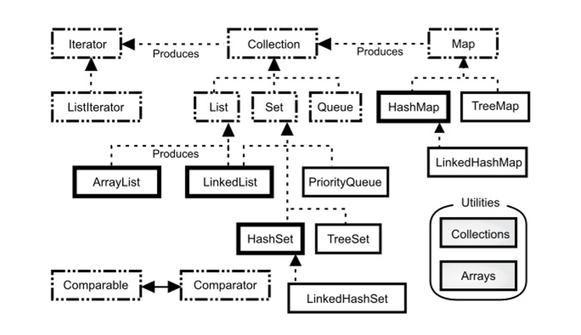

### java.util.Collection

* Collection 被称为容器，是搜集、放置数据的地方
* add 新增对象
* remove 移除对象
* java.lang.Iterable 遍历对象
* List 列表（有序，下标索引）
* Set 集合（不重复）
* Queue 队列（尾入头出）
* Deque 双向队列（两端都可以加入移除）
* 按需求使用不同的接口实现对象
  * ArrayList 实现了 List 接口
* Java 不仅提供了现成的已实现的接口，自行扩充也很方便
  * AbstractCollection 实现了 Collection 的基本行为
  * AbstractList 实现了 List 的基本行为
  * 可以自行继承 AbstractList 实现自己的 List，要比直接实现 List 方便很多

### Collection 架构



* <\<java.lang.Iterable>\>（产生了 <\<java.util.Iterator>\>）
  * <\<Collection>\>
    * <\<List>\>
      * ArrayList
      * LinkedList
    * <\<Set>\>
      * HashSet
      * TreeSet
    * <\<Queue>\>
      * PriorityQueue
      * <\<Deque>\>
        * LinkedList
        * ArrayDeque

### 具有索引的 List

* List 是一种 Collection，收集对象并以索引方式保留对象的顺序
* 接口 List 的实现类有 ArrayList、LinkedList

```java
import java.util.*;
import static java.lang.System.out;
public class Guest {
    public static void main (String[] args) {
        var names = new ArrayList();
        collectNameTo(names);
        out.println("访客名单：");
        printUpperCase(names);
    }
    static void collectNameTo (List names) {
        var s = new Scanner(System.in);
        while (true) {
            out.print("访客名称：");
            var name = s.nextLine();
            if (names.equals("quit")) break;
            names.add(name);
        }
    }
    static void printUpperCase (List names) {
        for (var i = 0; i < names.size(); i++) {
            var name = (String)names.get(i);
            out.println(name.toUpperCase());
        }
    }
}
```

#### ArrayList 特性

* 内部用 Object **数组**实现
* 数组在内存中是线性连续空间，根据索引随机存取速度快，如**适合排序**
* 但如果要调整索引顺序的话，就很慢，如**插入**到开头或中间，或从开头和中间删除
* **数组长度不会变**，长度不够时，会新建新数组，然后把东西拷过来
  * ArrayList 可对其构造函数指定容量 Capacity
  * 意思就是可以预先指定一个长度的数组（不指定为 10）
* 固定长度，经常索引，很少增减适合 ArrayList

#### LinkedList 特性

* 内部用**链表**实现
* 长度不固定（省空间）
* 取长度和取元素一样，都是从第一个元素遍历到指定下标元素（每次都重新计数效率低）
  * 不适合排序，因为每个元素的下一个元素都被固定了
* 调整索引顺序很简单，也就是说**适合插入和删除**
* 长度不固定，增减频繁适合 LinkedList

### 内容不重复的 Set

* Set 是一种 Collection，用于去重的场景，但是不保证顺序
* 接口 Set 的实现类有 HashSet、TreeSet

```java
import java.util.*;
import static java.lang.System.out;
public class WordCount {
    public static void main (String[] args) {
        var s = new Scanner(System.in);
        out.print("请输入英文：");
        var words = tokenSet(s.nextLine());
        out.printf("不重复单词有 %d 个：%s%n", words.size(), words);
    }
    static Set tokenSet (String line) {
        return new HashSet(Arrays.asList(line.split(" ")));
    }
}
```

#### HashSet 特性

* 判断对象是否重复：使用对象的 hasCode 与 equals 方法
* HashSet 实现底层是，在内存中开辟空间（Hash Bucket），每个空间对应个 Hash Code
* 如果对象要加入 HashSet，先调用该对象的 hashCode 获取哈希码
  * 如果哈希码对应的哈希桶为空，则直接放入
  * 如果哈希桶里面不为空，则调用 equals 比较

```java
import java.util.*;
import static java.lang.System.out;
class Student {
    private String name;
    private String number;
    public Student (String name, String number) {
        this.name = name;
        this.number = number;
    }
    @Override
    public int hashCode () {
        final int prime = 31;
        int res = 1;
        res = prime * res + (name == null ? 0 : name.hashCode());
        res = prime * res + (name == null ? 0 : name.hashCode());
        return res;
    }
    @Override
    public boolean equals (Object o) {
        if (this != o) {
            if (o == null || getClass() != o.getClass()) return false;
            Student st = (Student)o;
            if (name == null && st.name != null) return false;
            if (!name.equals(st.name)) return false;
            if (number == null && st.number != null) return false;
            if (!number.equals(st.number)) return false;
        }
        return true;
    }
    @Override
    public String toString () {
        return String.format("(%s, %s)", name, number);
    }
}
public class Students {
    public static void main (String[] args) {
        Set students = new HashSet();
        students.add(new Student("AAAA", "B123456"));
        students.add(new Student("BBBB", "B456789"));
        students.add(new Student("AAAA", "B123456"));
        out.println(students); // [(AAAA, B123456), (BBBB, B456789)]
    }
}
```

### 队列 Queue

* Queue 是一种 Collection
  * **后面存前面取**
  * 用 offer、poll、peek 代替 Collection 默认的 add、remove、element

| 基于异常处理 | 基于返回值 | 含义               |
| ------------ | ---------- | ------------------ |
| add          | offer      | 后端加入           |
| element      | peek       | 前端取出           |
| remove       | poll       | 前端取出（并删除） |

* 接口 Queue 的实现类有 ArrayDeque、LinkedList、Deque、PriorityQueue

#### LinkedList 也实现了 Queue

* 也就是说 LinkedList 具有 Queue 的行为，可以当做 Queue 来用（LinkedList 实例放入 Queue 的类型）

```java
import java.util.*;
interface Request { void execute(); }
public class RequestQueue {
    public static void main (String[] args) {
    	var requests = new LinkedList();
        offerRequestTo(requests);
        process(requests);
    }
    static void offerRequestTo (Queue requests) { // 模拟请求入队
        for (var i = 1; i < 6; i++)
            requests.offer(new Request() {
                public void execute () {
                    System.out.printf("处理数据 %f%n", Math.random());
                }
            });
    }
    static void process (Queue requests) { // 处理队列中的请求
        while (requests.peek() != null) {
            var request = (Request)requests.poll();
            request.execute();
        }
    }
}
```

#### 双向队列 Deque

* 双向队列 Deque 是队列 Queue 的子接口
  * 在任何一端都可以存取数据
  * Queue 永远从**后面存前面取**
* Queue 与 Deque 的重复操作

| Queue 方法 | Deque 等价方法 |
| ---------- | -------------- |
| add        | addLast        |
| offer      | offerLast      |
| remove     | removeFirst    |
| poll       | pollFirst      |
| element    | getFirst       |
| peek       | peekFirst      |

* Deque 也分两种不同处理错误的方式

| 基于异常处理 | 基于返回值 |
| ------------ | ---------- |
| addFirst     | offerFirst |
| addLast      | offerLast  |
| getFirst     | pollFirst  |
| getLast      | pollLast   |
| removeFirst  | peekFirst  |
| removeLast   | peekLast   |

* Deque 的实现类有 ArrayDeque、LinkedList

```java
import java.util.*;
public class Stack {
    private Deque elems = new ArrayDeque();
    private int capacity;
    public Stack (int capacity) { this.capacity = capacity; }
    public boolean push (Object elem) {
        if (isFull()) return false;
        // 对作为原始类型java.util.Deque的成员的offerLast(E)的调用未经过检查
        // 这是因为没有使用泛型
        return elems.offerLast(elem);
    }
    public Object pop () { return elems.pollLast(); }
    public Object peek () { return elems.peekLast(); }
    public int size () { return elems.size(); }
    @Override
    public String toString () {
        var res = "";
        var length = size();
        var bak = new Stack(length);
        for (var i = 0; i < length; i++) {
            var elem = stack.pop();
        	res += elem + "\n"; // 一般是要强制类型装换为 String
            bak.push(elem);
        }
        for (var i = 0; i < length; i++)
            stack.push(bak.pop());
        return res;
    }
    private boolean isFull () { return elems.size() >= capacity; }
    public static void main (String[] args) {
        var stack = new Stack(5);
        stack.push("AAA");
        stack.push("BBB");
        stack.push("CCC");
        System.out.println(stack);
        System.out.println(stack); // 两次都一样
    }
}
```

### 泛型 Generics

* 用 Object 存取的时候，会有一些问题
  * 存的时候，会警告：对作为原始类型java.util.XXX 的成员的 XXX(E) 的调用未经过检查
  * 取的时候，一般要用 Cast 语法进行强制类型转换
  * 也就是说用 Object 存取会丢失数据原本的类型，需要去人工记着本来的类型，然后再调用的时候 Cast
* \<E\> 中的 E 表示 Type parameter，代表类型形参（也可以是 T、K、V  等）
* 泛型统一了元素的类型，如果加入别的类型则会报错
  * 所以如果不用尖括号指定元素类型时，可以存任何东西（Object）

```java
import java.util.Arrays;
public class ArrayList<E> {
    private Object[] elems;
    private int next;
    public ArrayList (int capacity) { elems = new Object[capacity]; }
    public ArrayList () { this(16); }
    public void add (E e) { // 加入的数据必须是指定类型
        if (next == elems.length) elems = Arrays.copyOf(elems, elems.length * 2);
        elems[next++] = e;
    }
    @SuppressWarnings("unchecked") // 相当于 javac -Xlint:unchecked 就不会提示 未经检查的转换
    public E get (int index) { return (E)elems[index]; }
    public int size () { return next; }
    public static void main (String[] args) {
        //ArrayList<String> names = new ArrayList<String>(); // JDK5
        //ArrayList<String> names = new ArrayList<>(); // JDK7
        //var names = new ArrayList<>(); // 相当于<Object>
        var names = new ArrayList<String>(); // JDK10
        names.add("AAA");
        names.add("BBB");
        for (var i = 0; i < names.size(); i++) System.out.println(names.get(i));
    }
}
```

* 泛型也是语法糖，反编译后发现代码还是 JDK1.4 的（泛型从 JDK5 开始）

```java
import java.io.PrintStream;
import java.util.Arrays;
public class ArrayList {
    private Object elems[];
    private int next;
    public ArrayList (int i) { elems = new Object[i]; }
    public ArrayList () { this(16); }
    public void add (Object obj) {
        if(next == elems.length) elems = Arrays.copyOf(elems, elems.length * 2);
        elems[next++] = obj;
    }
    public Object get (int i) { return elems[i]; }
    public int size () { return next; }
    public static void main (String args[]) {
        ArrayList arraylist = new ArrayList();
        arraylist.add("AAA");
        arraylist.add("BBB");
        for(int i = 0; i < arraylist.size(); i++)
            System.out.println((String)arraylist.get(i)); // 这里
    }
}
```

* 泛型也支持接口和继承
  * 可以继承和实现部分类型（指明），也可以继承和实现全部类型
  * 接口或父类是泛型，如果实现或继承的时候不使用泛型或类型实参为空，则等价于 \<Object\>

```java
interface Comparator<T> { int compare(T a, T b); }
public class StringComparator implements Comparator<String> {
    @Override
    public int compare (String a, String b) { return -a.compareTo(b); }
}
```

* 泛型也可用在定义方法上（特别是静态方法）

```java
package tenchiang;
public static Object elemOf (Object[] objs, int index) {
    return objs[index];
}
public static <T> T elemOf (T[] objs, int index) {
    return objs[index];
}
// tenchiang.<String>elemOf()
```

#### @SuppressWarnings("unchecked")

* 使用泛型有时会警告：对作为原始类型java.util.XXX 的成员的 XXX(E) 的调用未经过检查
* @SuppressWarnings("unchecked")相当于 javac -Xlint:unchecked 就不会提示 未经检查的转换
* 但是还是要 Cast 强制类型转换

### Lambda 表达式简介

* 只要在声明时指定接口的类型，然后只有一个要实现的方法
  * 接口相当于函数声明，Lambda 相当于函数本身
* 形参处可以不指定参数类型，编译器可类型推断 Type inference
* 如果是单个参数，甚至无需加开括号
* Lambda 的一切都是为了简洁，所以不建议用来做太复杂的逻辑
  * Lambda 也可以加区块，加了区块默认不会返回，得指明 return

```java
interface InteferFunction { Integer apply(Integer i); }
InteferFunction doubleFunction = i -> i * 2;
doubleFunction.apply(2) // 4
```

* 泛型与 Lambda

```java
interface Comparator<T> { int compare(T a, T b);  }
Comparator<String> byLength = new Comparator<String>() { // JDK5
    public int compare (String s1, String s2) { return s1.length() - s2.length(); }
}
Comparator<String> byLength = new Comparator<>() { // JDK9（因为匿名内部类）
    public int compare (String s1, String s2) { return s1.length() - s2.length(); }
}
var byLength = new Comparator<>() { // JDK10
    public int compare (String s1, String s2) { return s1.length() - s2.length(); }
}
Comparator<String> byLength = (s1, s2) -> s1.length() - s2.length(); // Lambda
```

* 范例：改造 RequestQueue.java

```java
import java.util.*;
interface Request { void execute(); }
public class RequestQueue {
    public static void main (String[] args) {
    	var requests = new LinkedList<Request>(); // Queue<RequestQueue>
        offerRequestTo(requests);
        process(requests);
    }
    static void offerRequestTo (Queue<Request> requests) { // 模拟请求入队
        for (var i = 1; i < 6; i++)
            requests.offer( () -> System.out.printf("处理数据 %f%n", Math.random()) );
    }
    static void process (Queue<Request> requests) { // 处理队列中的请求
        while (requests.peek() != null) {
            var request = (Request)requests.poll();
            request.execute();
        }
    }
}
```

### 迭代器 Iterator 与  Iterable

```java
static void forEach (List list) { // ArrayList LinkedList
    for (var i = 0; i < list.size(); i++) System.out.println(list.get(i));
}
static void forEach (Set set) { // HashSet TreeSet 
    for (var obj : set.toArray()) System.out.println(obj);
}
static void forEach (Queue queue) { // ArrayDeque LinkedList Deque
    while (queue.peek() != null) System.out.println(queue.poll());
}
```

* 疑问，队列或者站，调用寻常的方法取出元素，遍历完也就空了（副作用）
* 实际上所有 Collection 都有一个 interator()
* JDK5 以前，interator() 定义在 Collection 接口中，之后提升至 java.lang.Iterable 父接口
  * interator() 会返回 java.util.Iterator 接口的实现对象，包括了 Collection 收集的所有元素
  * 可以使用 Interator 的 hasNext() 看一下有无元素，next() 取得元素
  * 相当于拷贝了个副本，遍历这个副本没有任何副作用

```java
static void forEach (Collection collection) {
    var iterator = collection.iterator();
    while (iterator.hasNext()) System.out.println(iterator.next());
}
```

* JDK5 开始，原先定义在 Collection 中的 iterator 方法，提升至 java.lang.Iterable 父接口
  * 因为 Collection 继承自 Iterable，而 Iterable 本身就有 iterator  方法

```java
static void forEach (Iterable iterable) {
    var iterator = iterable.iterator();
    while (iterator.hasNext()) System.out.println(iterator.next());
}
```

* JDK5 开始有了增强式 for 循环，可以直接用在实现 Iterable 接口的对象上（forEach 简化）
  * 增强型 for 其实还是调用的 iterator

```java
import java.util.*;
public class ForEach {
    static void forEach (Iterable iterable) {
        for (var o : iterable) System.out.println(o);
    }
    @SuppressWarnings("unchecked")
    public static void main (String[] args) {
        var names = Arrays.asList("AAA", "BBB", "CCC");
        forEach(names);
        forEach(new HashSet(names)); // HashSet ArrayDeque 接受 Collection
        forEach(new ArrayDeque(names));
    }
}

// jad 反编译
import java.io.PrintStream;
import java.util.*;
public class ForEach {
    public ForEach () {}
    static void forEach (Iterable iterable) {
        Object obj;
        for(Iterator iterator = iterable.iterator();
            	iterator.hasNext();
            	System.out.println(obj))
            obj = iterator.next();
    }
    public static void main (String args[]) {
        java.util.List list = Arrays.asList(new String[] { "AAA", "BBB", "CCC" });
        forEach(list);
        forEach(new HashSet(list));
        forEach(new ArrayDeque(list));
    }
}
```

* JDK8 开始，Iterable 新增了 forEach 方法，可在迭代时对元素进行处理
  * Iterable 的 forEach 方法接受 java.util.function.Consumer\<T> 接口的实例
  * 该接口只有一个 accept(T t) 方法需要实现，所以可以使用 Lambda
  * 甚至 Lambda 可以用 **方法参考 Method reference** 让表达式更简洁
    * 把参数都放进方法里
    * 但方法只能调用死的，无法自定义
  * 因为 JDK8 改进了 interface，允许接口自己实现 **默认方法 Default Method**，可以不实现
    * 如此可以更方便对接口进行扩展，不然实现了该接口的所有类都会受影响

```java
var names = Arrays.asList("AAA", "BBB", "CCC");
names.forEach(name -> System.out.println(name));
new HashSet(names).forEach(name -> System.out.println(name));
new ArrayDeque(names).forEach(name -> System.out.println(name));

var names = Arrays.asList("AAA", "BBB", "CCC");
names.forEach(System.out::println);
new HashSet(names).forEach(System.out::println);
new ArrayDeque(names).forEach(System.out::println);
```

### 比较器 Comparator 与 Comparable

* 存储元素后，排序是常规操作，java.util.Collections 提供了 sort 方法（注意有个 s）
* 必须有索引才能排序，因此 sort 接受 List
* 通过 **实现 java.util.Comparable 的 compareTo** 方法来自定义 sort 方法
  * compareTo 正数表示 a > b，负数表示 a < b，零表示 a == b
  * Integer 和 String 默认就实现了 Comparable，所以可以直接对整数和字符串进行排序

```java
import java.util.*;
public class Account implements Comparable<Account> {
    private String name;
    private String number;
    private int balance;
    public Account (String name, String number, int balance) {
        this.name = name;
        this.number = number;
        this.balance = balance;
    }
    @Override
    public String toString () {
        return String.format("Account(%s, %s, %d)", name, number, balance);
    }
    @Override
    public int compareTo (Account other) {
        return balance - other.balance;
    }
    public static void main (String args[]) {
        var accounts = Arrays.asList(
            new Account("AAA", "X1234", 1000),
            new Account("BBB", "X5678", 500),
            new Account("CCC", "X2468", 200),
        );
        Collections.sort(accounts);
        System.out.println(accounts);
    }
}
```

* **实现 java.util.Comparator**
* 不方便实现 Compareable 或无法访问或修改源码的时候
* Collections.sort 有另外的重载版本，可接受 Comparator.compare 的实现对象作为参数
* **排序总结**
  * 要么本身实现了 **Comparable.compareTo**（要访问源码）
    * 未实现则报错 ClassCastException
  * 要么另外实现 **Comparator.compare** 告诉 Coolections.sort 怎么排序（不用访问源码）
    * 自身有 sort 更好，只要告诉自身的 sort 即可（List.sort）
  * 排序都是针对元素来的，元素本身可比较，才能排序
    * 集合也能排序，如 TreeSet 根据红黑树的方式排序
    * Queue 的实现类 PriorityQueue，可指定优先级排序

#### 使用 Comparator 上的静态方法

* reverseOrder 反序
* nullsFirst 把 null 排在前头
* comparing
  * comparingInt
* thenComparing 多个字段比较

* 字符列表反序

```java
import java.util.*;
class StringComparator implements Comparator<String> {
    @Override // 倒序
    public int compare (String s1, String s2) { return -s1.compareTo(s2); }
}

var words = Arrays.asList("A", "C", "B");
Coolections.sort(wrods, new StringComparator()); // 普通用法
Coolections.sort(wrods, (s1, s2) -> -s1.compareTo(s2)); // Lambda
words.sort((s1, s2) -> -s1.compareTo(s2)); // JDK8在List增加了sort方法
//words.sort(String::compareTo); // Lambda方法参考 但无法自定义 所以不是反序

Collections.sort(words, Comparator.reverseOrder())
Collections.sort(words, Comparator.comparing(String::toString).reversed())
```

* Order nulls before non-null elements

```java
import java.util.*;
import static java.util.Comparator.*;
var words = Arrays.asList("A", null, "C", "B", null);
words.sort(nullsFirst(reverseOrder()));

words.sort(nullsFirst(comparingInt(String::length))); // 根据长度比较

customers.sort( // 多字段比较
    comparing(Customer::getLastName) // Comparator<Customer>
    .thenComparing(Customer::getFirstName)
    .thenComparing(Customer::getZipName)
);

// Refactor the Decorator pattern itself
public static Comparator<String> reverseOrder () { return (s1, s2) -> s2.compareTo(s1); }
public static Comparator<String> nullsFirst (Comparator<String> comparator) {
    return new NullsFirst(comparator);
}

public static class NullsFirst implements Comparator<String> {
    private final static int LEFT_IS_GREATER = 1;
    private final static int RIGHT_IS_GREATER = -1;
    private final Comparator<String> comparator;
    public NullsFirst (Comparator<String> comparator) { this.comparator = comparator; }
    public int compare (String a, String b) {
        if (a == null) return RIGHT_IS_GREATER;
        return s2 == null ? LEFT_IS_GREATER : comparator.compare(a, b);
    }
}

//static <T, U extends Comparable<? super U>>
//    Comparator<T>
//    comparing(Function<? super T, ? extends U> keyExtractor)
Comparator<String> comparator = comparing(new Function<String, String>() {
    public String apply (String alphabet) {
        return alphabet;
    }
};             
```

### 键值对 Map

* <\<Map>>
  * AbstractMap
    * HashMap
    * TreeMap
  * HashTable（继承自 Dictionary）
    * Properties
* Dictionary、HashTable 为 JDK1.0 遗留，不建议用
* Properties 用的挺多

#### 无序 HashMap

* put 存键值对，get 取键值对

```java
import java.util.*;
//Map<String, String> msgs = new HashMap<>();
var msgs = new HashMap<String, String>();
msgs.put("BBB", "BBB's value");
msgs.put("AAA", "AAA's value");
msgs.put("CCC", "CCC's value");
System.out.println(msgs.get("AAA")); // AAA's value
System.out.println(msgs); // {AAA=AAA's value, CCC=CCC's value, BBB=BBB's value}
```

#### 有序 TreeMap

* 会根据 Key 自动排序
* Key 必须实现 Comparable 接口
* 或在构造时指定 Comparator 实现对象

```java
import java.util.*;
var msgs = new TreeMap<String, String>((a, b) -> -a.compareTo(b)); // 倒序
msgs.put("BBB", "BBB's value");
msgs.put("AAA", "AAA's value");
msgs.put("CCC", "CCC's value");
System.out.println(msgs.get("AAA")); // AAA's value
System.out.println(msgs); // {CCC=CCC's value, BBB=BBB's value, AAA=AAA's value}
```

#### 使用 Properties

* Properties 继承自 HashTable，HashTable 实现了 Map 接口
* 一般用 setProperty 和 getProperty 存取键值对（属性名称与属性值）
* 也可以通过 load 读取文件配置，读取后自动关闭 InputStream 实例
  * load 的文件后缀一般是 properties，内容是 key=value

```java
// person.properties
// tenchiang.username=YY
// tenchaing.password=123456
import java.io.*;
import java.util.Properties;
public class LoadProperties {
    public static void main (String[] args) throws IOException {
        var props = new Properties();
        props.load(new FileInputStream(args[0]));
        System.out.println(props);
    }
}
// java LoadProperties.java person.properties
// {tenchiang.username=YY, tenchaing.password=123456}
```

* 也可以使用 loadFromXML 读取文件

```xml
<?xml version="1.0" encoding="UTF-8"?>
<!DOCTYPE properties SYSTEM "http://java.sun.com/dtd/properties.dtd">
<properties>
    <comment></comment>
    <entry key="tenchiang.username">YY</entry>
    <entry key="tenchiang.password">123456</entry>
</properties>
```

* 也可以在 JVM 启动时，通过 -D 指定系统属性
  * System.getProperties 返回 Properties
  * 会去到其它很多系统属性
    * java.version
    * java.class.version

```java
// java -Dusername=YY -Dpassword=123456 LoadSysProps
import java.util.Properties;
public class LoadSysProps {
    public static void main (String[] args) {
        System.out.println(System.getProperties());
    }
}
```

#### 遍历 Map 键值

* keySet 返回键 Set（表示 key 不重复）
* values 返回值 Collection
* entrySet 返回一个 Set，每个元素都是 Map.Entry 的实例
  * getKey、getValue
* forEach 接收 java.util.function.BigConsumer<T, U> 接口的实现对象
  * 必须实现 void accept(T t, U u)
  * Map 没有继承 Collection 和 Iterable
* [【JDK8】Map 便利的預設方法](https://openhome.cc/Gossip/CodeData/JDK8/Map.html)

```java
var map = new HashMap<String, String>();
map.put("one", "一");
map.put("two", "二");
map.keySet().forEach(System.out::println);
map.values().forEach(System.out::println);
map.forEach((k, v) -> System.out.printf("%s: %s%n", k, v));
foreach(map.entrySet());

static void foreach (Iterable<Map.Entry<String, String>> iterable) {
    for (Map.Entry<String, String> entry : iterable)
        System.out.printf("%s: %s%n", entry.getKey(), entry.getValue());
}
```

### 不可变 Immutable 的 Collection 与 Map

* Immutable 是函数式编程的概念之一
* 不可变对象 Immutable object  的好处
  * 因为不可变，所以没有副作用（Side effect）
  * 变量不改变，**让状态更容易管理，适合并行**（Concurrent）（防止线程竞态，容易共享）
* Java 中实现不可变
  * 不可变变量：final 修饰
  * 不可变对象：无对应类型
* Collection 的有些方法是可选的（API 文档上会标识出来）
  * 可选的：不实现该方法的指定功能，只是抛出 UnsupportedOperationException
  * 如果调用该方法则报错，以模拟不可变对象（函数式编程）
  * API 其实帮你实现了，如 Collections 内部定义的 UnmodifiableCollection 类
    * `public static <T> Collection<T> unmodifiableCollection (Collection<? extends T> c) { return new UnmodifiableCollection<>(c); }`
  * API文档：[Collections Framework Overview](https://docs.oracle.com/javase/8/docs/technotes/guides/collections/overview.html)
* JDK8 以及之前：Collections 提供的
  * unmodifiableCollection、unmodifiableList、unmodifiableSet、unmodifiableMap
  * 通过以上方法可包装出无法修改 unmodifiable 的对象
  * 也可通过 guava-libraries 来获得
  * [專欄文章：Guava 教學](https://openhome.cc/Gossip/CodeData/GuavaTutorial/)
* JDK9 开始，在 List、Set、Map 上提供 of 方法，直接创建不可变的对象
  * `static <E> List<E> of () { return ImmutableCollections.emptyList();  }`

#### Collections 的 unmodifiableXXX 方法

* 没有新建，只是包装了下，使之无法修改（原来的还是可以改导致一起改）
  * Arrays.asList 和 unmodifiableXXX 一样，都引用了原对象
* 而 JDK9 的 List、Set、Map 等，提供的静态方法 of，是直接创建不可变对象
  * Map.of(k1, v1, k2, v2)
* of 使用的是**浅拷贝**，只要不改变元素本身，不可变性还是强于 unmodifiableXXX 的
  * 在变量少于 10 个的情况下，会有对应个数的 of 重载版本，因此不会引用到原来的对象
  * 超过 10 个，会新建一个数组，然后对元素浅拷贝
  * 增强 of：对元素的字段用 final 定义，保证元素也不可变

```java
List<String> nameList = List.of("AAA", "BBB");
Set<String> nameSet = Set.of("AAA", "BBB");
Map<String, Integer> = Map.of("AAA", 123, "BBB", 456);

@stable
private final E[] elements;
@SafeVarargs
ListN (E... input) {
    // copy and check manually to avoid TOCTOU
    @SuppressWarnings("unchecked");
    E[] tmp = (E[])new Object[input.length]; // implicit nullcheck of input
    for (int i = 0; i < input.length; i++)
        tmp[i] = Objects.requireNonNull(input[i]);
    elements = tmp;
}
```

* Time of Check Versus Time of Use （TOCTOU）

* > 应用运行的过程中，在某个操作之前，比如写文件，都会检查一下文件是否存在，在检查与真正的写入之间的间隔就是一个可以被利用的 Race Condition，恶意软件可以将用户检查的文件替换成自己的文件，这样数据就泄露了

* [软件漏洞的主要来源_Bluelich的专栏-CSDN博客](https://blog.csdn.net/hnjyzqq/article/details/43328427)