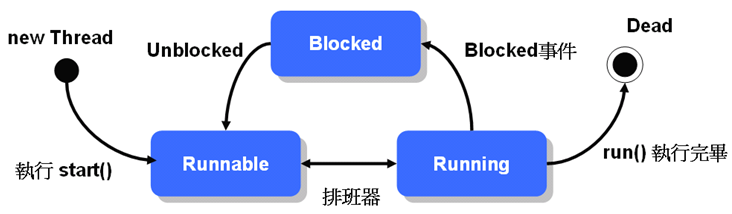

### 并发编程

* 并发是提高**单核**性能
* 虽然增加了上下文切换的开销，但是避免了**阻塞**（通常是 I/O）
* 除了并发，还有一个是事件驱动
* 实现并发的两种方式
  * 多进程：一个系统运行多个进程，并由系统调度切换
    * 一个进程，一个程序，一个任务，多进程就是多任务
    * 缺点：开销大、操作系统不提供就不支持
  * 多线程：一个进程，多个线程，多个任务
    * 函数式编程：函数没有副作用，以此将任务彼此隔离不干涉（相当于只有常量）
    * 抢占式多线程（preemptive）：调度器中断线程，切换上下文到另一个线程（如 Java）
    * 协作式多线程（cooperative）：自动放弃控制（让步语句），上下文切换比抢占式开销小

### 并发和并行的区别

* 并发（Concurrency）：解决 I/O 密集型问题（I/O-bound）、同时执行多个任务（共享资源的访问控制）
* 并行（Parallelism）：解决 CPU 密集型（compute-bound）、同时在多个地方（处理器）执行一个任务的多个部分（利用额外资源）（分布式）
* Java 用线程（Thread）同时实现并发和并行
* 纯并发（Purely Concurrent）：在单核 CPU 上运行多个任务
* 并发-并行（Concurrent-Parallel）：使用并发技术，生成的程序可以利用更多的处理器并更快地生成结果
* 并行-并发（Parallel-Concurrent）：使用并行编程技术，就算只有单核也可运行（Java8 的 Stream）
* 纯并行：只能运行在多个处理器上
* 有漏洞的抽象（Leaky Abstraction）：
  * 抽象的目标是抽象掉那些对手头的想法不重要的部分以免受不必要的细节影响
  * 有的时候抽象会失效，会暴露出底层的细节，这就是抽象的漏洞
  * 比如 GC 下的内存泄漏：GC 本来是避免手动管理内存时容易发生的内存泄漏，如果自动内存管理下都有内存泄漏，那说明该 GC 是 Leaky Abstraction（除了 GC 就是并发了）
  * [抽象泄漏(leaky abstraction) - Hejin.Wong - 博客园](https://www.cnblogs.com/egger/archive/2013/02/11/2910137.html)

### 线程 Thread

* 以前只是单线程，就是 main 方法这个 **主线程（Main thread）**
* 想在 main 之外新建一个独立的流程，实现 java.lang.Runnable 接口的 run 方法
  * 主线程的入口是 main，其它线程的入口就是 run
* 再构造 Thread 把 Runnable 传进去，调用 start 启动线程

```java
class Tortoise implements Runnable {
    private int totalStep;
    private int step;
    public Tortoise (int totalStep) { this.totalStep = totalStep; }
    @Override
    public void run () {
        while (step < totalStep) {
            step++;
            System.out.printf("乌龟跑了 %d 步...%n", step);
        }
    }
}
class Hare implements Runnable {
    private boolean[] flags = { true, false };
    private int totalStep;
    private int step;
    public Hare (int totalStep) { this.totalStep = totalStep; }
    @Override
    public void run () {
        while (step < totalStep) {
            var isSleep = flags[((int)(Math.random() * 10)) % 2];
            if (isSleep)
                System.out.println("兔子睡着了 zzz");
            else {
                step += 2;
            	System.out.printf("兔子跑了 %d 步...%n", step);
            }
        }
    }
}
public class TortoiseHareRace {
    public static void main (String[] args) {
        new Thread(new Tortoise(10)).start();
        new Thread(new Hare(10)).start();
    }
}
```

### Thread 和 Runnable

* 除了实现 Runnable.run 外，也可直接继承 Thread，然后重写 run 方法
  * 使用 Runnbale 可把类和 Thread 分开，降低耦合
  * 因为如果继承了 Thread，就是一种 Thread，如果原来的类还要继承别的类就不方便了
  * 通常直接继承 Thread 实现多线程是为了直接利用 Thread 中定义的一些方法
* Thread 本身也实现了 Runnable，调用 Thread .start 会调用 Thread.run

```java
private Runnable runnable;
public void run () {
	if (runnable != null) runnable.run();
}
```

* 直接继承 Thread 的例子

```java
public class TortoiseThread extends Thread { // 省略
    @Override
    public void run () {}
}
public class HareThread extends Thread { // 省略
    @Override
    public void run () {}
}
public class TortoiseHareRace {
    public static void main (String[] args) {
        new TortoiseThread(10).start();
        new HareThread(10).start();
    }
}
```

* JDK8 可用 Lambda 实现 Runnable 以建立 Thread
  * 注意 Lambda 的方法体必须由花括号包起来，因为 run 没有返回值

```java
{ // 在 jshell 运行
    var totalStep = 10;
    new Thread(() -> {
        var step = 0;
        while (step < totalStep) System.out.printf("乌龟跑了 %d 步...%n", ++step);
    }).start();
    new Thread(() -> {
        var step = 0;
        boolean[] flags = { true, false };
        while (step < totalStep) {
            if (flags[((int)(Math.random() * 10)) % 2])
                System.out.println("兔子睡着了 zzz");
            else {
                step += 2;
                System.out.printf("兔子跑了 %d 步...%n", step);
            }
        }
    }).start();
}
```

### 线程生命周期

* 线程的生命周期很复杂

#### Daemon 守护线程

* 主线程会从 main 方法开始执行，知道 main 方法结束后停止 JVM
* 默认情况下，主线程有额外线程，会执行完额外线程的所有 run 方法后才终止 JVM
  * **线程不是函数**，不要想着额外线程执行完后会返回到主线程的 main 方法
* 如果有守护线程的话，在所有非守护线程都结束时，JVM 就会终止
  * 主线程不是守护线程
  * **setDaemon** 设置线程是（true）否（false）为守护线程
  * isDaemon 判断线程是否为守护线程
* 从守护进程生成的进程默认也是守护进程，如果父守护线程终止了，子守护线程也会终止

```java
public class DaemonDemo {
    public static void main (String[] args) {
        var thread = new Thread(() -> { while (true) System.out.println("Orz"); });
        thread.setDaemon(true);
        thread.start();
    }
}
// 线程执行的时间刚好是main做了这一系列操作的时间
// main的操作 新建线程、设置为守护线程、开启线程
// main在执行完后这一些列操作之后就结束了
// 而守护线程在所有非守护线程执行完后也结束了，整个JVM停止
```

### Thread 基本状态图

* 实例化 Thread 并执行 start 方法后，其基本状态可分为
  * 可执行 Runnable
  * 被阻断 Blocked（休眠）
  * 执行中 Running
* Thread基本状态图（其中排班器指的是 Scheduler）



#### 线程的优先级

* Thread.setPriority 设置线程优先级
* 优先级范围为 Thread.MIN_PRIORITY（1） 到 Thread.MAX_PRIORITY（10）
* 数字越大优先级越高，Scheduler 会优先排入 CPU
* 如果优先级相同，则轮流执行（Round-robin）
* 范围之外返回会抛出 IllegalArgumentException

#### 可执行 Runnable

* 此时并未执行 run 方法，需等待 Scheduler 排入 CPU 执行
* 进入 Runing 状态，此时 run 方法才执行
* 在同一时刻，一个 CPU 的核心只能执行一个线程，但是因为会快速切换，看起来是同时执行线程
* 双核四线程：在同一时刻，能同时执行两个线程，存储四个线程的信息，在这四个线程中互相切换的代价比较小
* 线程是 CPU 级别的调度单位，进程是 OS 级别的调度单位
* [请问CPU在同一时间内只执行一个线程吗?_已解决_博问_博客园](https://q.cnblogs.com/q/71113/)

#### 被阻断 Blocked

* 有几种情况会让线程进入 Blocked 状态（休眠）
  * 调用 Thread.sleep 方法
  * 进入 synchronized 前竞争对象锁定
  * 调用 wait 方法
  * 等待输入输出完成
    * 输入输出完成后变成 Runnable 状态，等待 Scheduler
* 可以执行 Blocked 的线程的 interrupt 方法（抛出 InterruptedException 受检异常），唤醒休眠线程
  * 如果线程是因为某些情况意外唤醒，应该做哪些收尾，如清除线程目前使用的资源等操作
  * [Java theory and practice: Dealing with InterruptedException](https://www.ibm.com/developerworks/java/library/j-jtp05236/)

```java
var thread = new Thread(() -> {
    try {
        Thread.sleep(99999); // 线程运行就休眠
    } catch (InterruptedException e) { // 被唤醒
        System.out.println("我醒了");
        throw new RuntimeException(e);
    }
});
thread.start(); // 主线程开启线程后，线程立刻休眠
thread.interrupt(); // 主线程唤醒线程thread，使之运行异常捕捉那一部分
```

* 利用多线程，在一个线程 Blocked 时，让另一个线程 Running 避免 CPU 空闲，有效提高性能

```java
import java.net.URL;
import java.io.*;
public class Download {
    private static byte[] data = new byte[1024];
    static void dump (InputStream src, OutputStream dest) throws IOException {
        try (src; dest) {
            for (int len; (len = src.read(data)) != -1;) dest.write(data, 0, len);
        }
    }
    private static void sync (URL[] urls, String[] fileNames) throws IOException {
        for (int i = 0; i < urls.length; i++)
            dump(urls[i].openStream(), new FileOutputStream(fileNames[i]));
    }
    private static void async (URL[] urls, String[] fileNames) throws Exception {
        for (int i = 0; i < urls.length; i++) {
            int index = 1; // index等价final, i不等价
            new Thread(() -> {
                try {
                    dump(urls[index].openStream(), new FileOutputStream(fileNames[index]));
                } catch (IOException e) {
                    throw new RuntimeException(e);
                }
            }).start();
        }
    }
    public static void main (String[] args) throws Exception {
        URL[] urls = {
            new URL("https://openhome.cc/Gossip/Encoding/"),
            new URL("https://openhome.cc/Gossip/Scala/"),
            new URL("https://openhome.cc/Gossip/JavaScript/"),
            new URL("https://openhome.cc/Gossip/Python/"),
        };
        String[] fileNames = {
            "Encoding.html",
            "Scala.html",
            "JavaScript.html",
            "Python.html",
        };
        long startTime = System.currentTimeMillis();
        sync(urls, fileNames);
        long syncUsed = System.currentTimeMillis() - startTime;
        startTime = System.currentTimeMillis();
        async(urls, fileNames);
        long asyncUsed = System.currentTimeMillis() - startTime;
        System.out.printf("syncUsed = %dms asyncUsed = %dms %d%n", syncUsed, asyncUsed, syncUsed / asyncUsed);
    }
}
// syncUsed = 4387ms asyncUsed = 9ms 487
// 基本上差几百倍
```

#### 插入线程 join

* join 表示将线程加入成为另一个线程的流程（就像调用函数一样）
  * 在这个线程结束之前，调用 join 的线程一直处于等待状态
  * a 中调用 b.join，a 暂停，b 执行完后，a 继续执行
* join 可指定超时毫秒数，加入的线程最多运行这么多毫秒

```java
{
    System.out.println("线程Main开始");
    var thread = new Thread(() -> {
        System.out.println("线程thread开始");
        System.out.println("线程thread结束");
    });
    thread.start();
    thread.join(); // 线程Main使线程thread加入自己，成为自己流程的一部分
    System.out.println("线程Main结束");
}
/*
join：
线程Main开始
线程thread开始
线程thread结束
线程Main结束

未join：
线程Main开始
线程Main结束
线程thread线程开始
线程thread线程结束
*/
```

#### 线程停止 Dead

* 线程完成 run 后，会进入 Dead 状态
* 进入 Dead 或已经 start 过一次不可再 start，否则抛出 IllegalThreadStateException
  * 也就是说，线程不在 Dead 状态且没有 start 过才能够调用 start 方法
* **不要直接停止线程**
  * Thread 有定义 stop 方法（Deprecated）
  * 会强制释放已锁定对象（可能会使对象陷入无法预期状态）
  * 此外还有 resume、suspend、destroy 等方法，都是 Deprecated
  * 如果要停止线程，最好自行实现，让线程跑完既有流程，而不是调用 stop
  * 如果某线程陷入死循环，应该让它有机会离开死循环

```java
public class Some implements Runnable {
    private boolean isContinue = true;
    public void stop () { isContinue = false; }
    public void run () {
        while (isContinue) {
            // 想要停止死循环 调用Some实例的stop方法即可
        }
    }
}
```

#### 线程的名称

* 获取线程名称 thread.getName()
* 获取当前线程名称 Thread.currentThread().getName()

```java
private static int createCount = -1;
private synchronized static String newName () { // 线程的默认名称
	if (createCount == -1) {
		createCount++;
		return "main"; // main是第0个线程
	} else {
		return "Thread-" + createCount++; // 从Thread-1开始
	}
}
```

### 线程组 ThreadGroup

* 线程都属于某个线程组
  * 主线程中创建的线程，属于 mian 线程组
  * `Thread.currentThread().getThreadGroup().getName()` 获取当前线程组名称
* 每个线程创建时，如果没有指定线程组，则会继承父线程的线程组
* 一旦线程加入某线程组，就无法再更改（线程组只能在创建线程时指定）

#### java.lang.ThreadGroup 的常用方法

* interrupt 中断线程组中断所有线程
* setMaxPriority 设置线程组中的最大优先级（本来有更高优先级的线程不受影响）
* enumerate 传入 Thread[] 获取组中所有线程，如果数组不够大则不拷贝
* activeCount 获取线程的个数，通常用来辅助创建 enumerate 的参数
* getName 获取线程组的名称，最初是 system（main 线程属于 main 线程组）
* uncaughtException 方法：线程组中发生未捕捉异常，JVM 就会调用此方法
  * 如果有父线程组，则会调用父线程组的 uncaughtException  方法
  * uncaughtException 默认为空，可以重写该方法
    * 第一个参数：发生异常的线程实例（Thread）
    * 第二个参数：异常的实例（Throwable）
  * 如果都没有 uncaughtException 且异常为 ThreadDeath 实例，printStackTrace

```java
var group = new ThreadGroup("group");
var thread = new Thread(group, "group's member"); // 创建新进程并制定组和线程名（没有 runnable）
Thread[] threads = new Thread[group.activeCount()];
group.enumerate(threads);
```

*  重写线程组的异常处理方法 uncaughtException（不推荐）

```java
new Thread(new ThreadGroup("group") {
    @Override
    public void uncaughtException (Thread thread, Throwable throwable) {
        System.out.printf("%s: %s%n", thread.getName(), throwable.getMessage());
    }
}, () -> { throw new RuntimeException("测试异常"); }).start(); // Thread-1: 测试异常
```

* 设置线程的异常处理方法（推荐）

```java
{
    var group = new ThreadGroup("group");
    var thread1 = new Thread(group, () -> { throw new RuntimeException("测试异常111"); });
    var thread2 = new Thread(group, () -> { throw new RuntimeException("测试异常222"); });
    thread1.setUncaughtExceptionHandler(
        (t, e) -> System.out.printf("%s: %s%n", t.getName(), e.getMessage()));
    thread1.start();
    thread2.start(); // 默认显示堆栈追踪
}
```

### 线程未捕获异常的处理

* 起点是发生异常线程的 uncaughtException(Throwable e) 方法
  * 该方法会调用 getUncaughtExceptionHandler() 获取 Thread.UncaughtExceptionHandler 接口的实例
    * Thread.UncaughtExceptionHandler 接口
    * 只有唯一的抽象方法 uncaughtException(Thread t, Throwable e)
  * 实例如果不为空则执行其中的 uncaughtException 方法
    * 实例可能是通过 setUncaughtExceptionHandler 方法设置的 exceptionHandler
    * 或者是线程组（同样实现了 Thread.UncaughtExceptionHandler 接口）
    * 目的是把该线程和异常的实例往上传递
* 线程组的 uncaughtException 方法
  * 父线程组的 uncaughtException()，会一直往上到 system 线程组（顶层）
  * 调用 Thread.getDefaultUncaughtExceptionHandler 方法获取 defaultExceptionHandler
    * 由 Thread.setUncaughtExceptionHandler 方法设置
  * 异常不属于 ThreadDeath 则 printStackTrace 否则什么都不做
* 注意：
  * exceptionHandler、defaultExceptionHandler 都是 UncaughtExceptionHandler 接口的实例
  * 线程组也实现了 UncaughtExceptionHandler 接口
  * 如果线程死了（ThreadDeath）默认不处理，但是可以指定 exceptionHandler、defaultExceptionHandler 处理
  * ThreadDeath 是一种错误（继承了 Error）
  * 线程已捕获的异常是线程具体业务逻辑的一部分，不做讨论
  * 线程未捕获异常一般在顶层就显示了出来或什么也不管（线程死亡）
    * 不一般的情况下很多方法都可以重写，情况就复杂起来
    * 如线程和线程组的 uncaughtException 方法都可以重写
* 总结：
  * 线程的的 uncaughtException 方法（只有一个 Throwable 参数）
    * exceptionHandler
    * 线程组的 uncaughtException 方法
      * 父线程组的 uncaughtException 方法
      * defaultExceptionHandler
      * 非死亡异常则报错

```java
public class Thread implements Runnable {
    private volatile UncaughtExceptionHandler exceptionHandler;
    private volatile static UncaughtExceptionHandler defaultExceptionHandler;
    @FunctionalInterface
    public static interface UncaughtExceptionHandler { 
        public void uncaughtException(Thread thread, Throwable throwable);
    }
    public UncaughtExceptionHandler getUncaughtExceptionHandler() {
        if (exceptionHandler == null) return getThreadGroup();
        return exceptionHandler;
	}
    public void setUncaughtExceptionHandler(UncaughtExceptionHandler handler) {
        exceptionHandler = handler;
    }
    public static UncaughtExceptionHandler getDefaultUncaughtExceptionHandler() {
        return defaultExceptionHandler;
    }
    public static void setDefaultUncaughtExceptionHandler(UncaughtExceptionHandler handler) {
        SecurityManager security = System.getSecurityManager();
        if (security != null)
            security.checkPermission(com.ibm.oti.util.RuntimePermissions
                                     .permissionSetDefaultUncaughtExceptionHandler);
        defaultExceptionHandler = handler;
    }
    void uncaughtException(Throwable e) {
        UncaughtExceptionHandler handler = getUncaughtExceptionHandler();
        if (handler != null)
            handler.uncaughtException(this, e);
    }
}

public class ThreadGroup implements Thread.UncaughtExceptionHandler {
    public void uncaughtException(Thread t, Throwable e) { // in ThreadGroup
        Thread.UncaughtExceptionHandler handler;
        if (parent != null) {
            parent.uncaughtException(t,e);
        } else if ((handler = Thread.getDefaultUncaughtExceptionHandler()) != null) {
            handler.uncaughtException(t, e);
        } else if (!(e instanceof ThreadDeath)) {
            // No parent group, has to be 'system' Thread Group
            // K0319 = Exception in thread "{0}" 
            // getString 第一个参数为格式化字符串对应的 key，第二个参数为格式化字符串中的实参
            System.err.print(com.ibm.oti.util.Msg.getString("K0319", t.getName())); // $NON-NLS-1$
            e.printStackTrace(System.err);
        }
    }
}
```

### 同步的 synchronized 和易失的 volatile

* 竞态条件（Race condition）：多个线程存取同一资源可能会引发的
* 线程安全（Thread-safe）：多线程存取同一资源，也不会脱离原来的逻辑
* 两种结果
  * 报 OutOfMemmoryError（JVM 分配的内存不够，不做讨论）
  * 报 ArrayIndexOutOfBoundsException（有几率会发生）
    * next 差一个就等于 elems.length 了，线程 t1、t2
    * t1 调用 add 即将执行到 next++ 这里
    * 调度器置 t1 为 Runnable，置 t2 为 Running
    * t2 调用 add 执行完 next++
    * 调度器置 t2 为 Runnable，置 t1 为 Running
    * t1 调用 add 执行 next++，此时 next ==  elems.length，于是报错
    * 可以说 ArrayList.add 在竞态条件下，是非线程安全的

```java
{
    var list = new ArrayList();
    new Thread(() -> { while (true) list.add(1); }).start();
    new Thread(() -> { while (true) list.add(2); }).start();
}
public void add (Object o) { // ArrayList.add
    if (next == elems.length) elems = Arrays.copyOf(elems, elems.length * 2);
    elems[next++] = o;
}
```

### 使用 synchronized

* 每个对象都有个**内部锁（Intrinsic lock）**，或叫监视锁（Monitor lock）
  * 内部锁的获取和释放由 JVM 自动管理
* synchronized 修饰方法，相当于对方法所在对象锁定
  * 线程只有取得其内部锁，在能够调用方法，调用完再释放锁
  * 如果没有取得锁，是无法调用方法的，进入等待锁定状态
* synchronized 也可用来修饰语句块
  * 取得括号里的对象的锁，才能够执行该语句块
  * 一般用来不想锁定整个方法，只是想锁定产生竞态的语句块（更有效率）
* Collections 有能够直接装饰 Collection 对象为线程安全对象的方法（简化）
  * synchronizedCollection
  * synchronizedList
  * synchronizedSet
  * synchronizedMap
* 直接使用 synchronized 关键字，可以提供更细致的操作
  * 如果用同一个对象同步化多个语句块或方法
  * 同一时间只能执行一个（另一个线程因为没取得锁而 Blocked）
* synchronized 提供 **可重入同步（Reentrant Synchronization）**
  * 线程取得某对象的锁定后，执行过程中又要执行 synchronized 时
  * 如果是同一个对象，则直接执行
* **死锁（Dead lock）**
  * 线程无法取得锁定时会 Blocked 阻断
  * 资源在多线程下彼此交叉调用：你不放开那个的锁，我就不放开这个资源的锁
    * 一个线程锁定了一个对象，调用了另外的锁定对象，所以等待那个对象执行完
    * 那个对象又调用了这个对象，所以也等待，两个都等待让程序卡住就是死锁
  * 死锁一般无解，需用程序设计避免发生

```java
public synchronized void add (Object o) { // ArrayList.add
    if (next == elems.length) elems = Arrays.copyOf(elems, elems.length * 2);
    elems[next++] = o;
}

public void add (Object o) {
    synchronized(this) { // 锁定语句块
        if (next == elems.length) elems = Arrays.copyOf(elems, elems.length * 2);
        elems[next++] = o;
    }
}

class Resource { // 死锁（可能）
    private String name;
    private int res;
    Resource (String name, int res) { 
        this.name = name;
        this.res = res;
    }
    String getName () { return name; }
    int getRes () { return res; }
   	synchronized int doSome () { return ++res; }
    synchronized void cooprate (Resource resource) {
        resource.doSome();
        System.out.printf("%s(%d) 整合 %s(%d) 的资源%n"
                          , getName(), getRes(), resource.getName(), resource.getRes());
    }
    public static void main (String[] args) {
        var res1 = new Resource("res1", 10);
        var res2 = new Resource("res2", 20);
        new Thread(() -> { for (var i = 0; i < 100; i++) res1.cooprate(res2); }).start();
        new Thread(() -> { for (var i = 0; i < 100; i++) res2.cooprate(res1); }).start();
    }
}
// Resource.main(new String[] {})
// 线程1取得res1的锁，线程2取得res2的锁
// 线程1执行res2的方法，需要取得锁（已被线程2锁定），所以线程2进入Blocked
// 线程2执行res1的方法，需要取得锁（已被线程1锁定），所以线程1进入Blocked
```

* 加入锁定概念的线程状态图
  * 线程尝试执行 synchronized 区块，等待锁定（进入 Blocked）
  * 线程取得区块的锁（进入 Runnable）
  * 调度器执行线程（进入 Running）


* 线程释放锁的两种情况
  * 线程执行完代码，然后释放
  * 线程执行发生异常，JVM 让线程自动释放锁

### 使用 volatile

* **互斥性（Mutual exclusion）**：一个同步块里，只能有一个锁
* **可见性（Visibility）**：一个同步块被一个线程执行后，下一个线程读取的是改变后的值
  * 上两个锁（太慢）
  * volatile
* 对于可见性，可以用 volatile 表示变量是不稳定、易变的（多线程），要保证其可见性（不用缓存）
* volatile 变量一旦被更改，其它线程会立刻知道
* 脏读违反可见性
  * Java内存模型规定所有的变量都是存在主存当中，每个线程都有自己的工作内存
  * 线程对变量的所有操作都必须在工作内存中进行，而不能直接对主存进行操作
  * 并且每个线程不能访问其他线程的工作内存。变量的值何时从线程的工作内存写回主存，无法确定
* [java volatile关键字作用及使用场景 - 孜然狼 - 博客园](https://www.cnblogs.com/YLsY/p/11295732.html)

```java
public class Some implements Runnable {
    private volatile boolean isContinue = true;
    public void stop () { isContinue = false; }
    public void run () {
        while (isContinue) {
            // ...
        }
    }
}
```

* [Java theory and practice: Managing volatility](https://www.ibm.com/developerworks/java/library/j-jtp06197/)